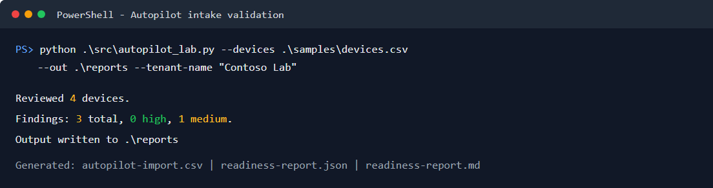
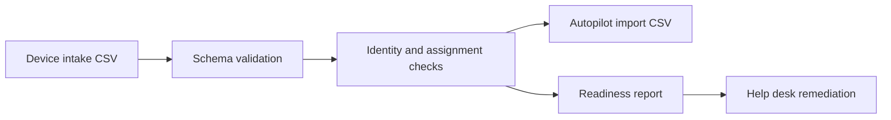

# Intune Autopilot Lab Kit

[](https://github.com/vxti-glitch/intune-autopilot-lab-kit/actions/workflows/python-tests.yml)


A portfolio-ready help desk lab for preparing Windows devices for Microsoft Intune and Windows Autopilot onboarding.

This project is intentionally offline-safe. It does not connect to a tenant, upload device hashes, or require Microsoft Graph permissions. Instead, it mirrors the intake, validation, import-file preparation, and documentation workflow a Tier 1 or Tier 2 technician would use before handing devices to an endpoint admin.



_Sample run using the included synthetic Contoso device data._

## What it demonstrates

- Autopilot device intake validation
- Import CSV generation using the columns expected by Windows Autopilot
- Duplicate serial and hardware hash detection
- Assigned user and group tag hygiene checks
- Device age and readiness reporting
- Help desk runbook writing
- Automated Python unit tests and GitHub Actions CI

## Workflow



## Quick start

```powershell
python .\src\autopilot_lab.py --devices .\samples\devices.csv --out .\reports --tenant-name "Contoso Lab"
```

Use `--fail-on-high` when running this in automation and you want duplicate device identity issues to fail the job.

Generated files:

- `reports/autopilot-import.csv`
- `reports/readiness-report.json`
- `reports/readiness-report.md`

See the checked-in [example readiness report](docs/examples/readiness-report.md), [example JSON](docs/examples/readiness-report.json), and [example import CSV](docs/examples/autopilot-import.csv).

## Input CSV

Required columns:

- `SerialNumber`
- `HardwareHash`
- `GroupTag`

Recommended columns:

- `AssignedUser`
- `Manufacturer`
- `Model`
- `PurchaseDate`

Example:

```csv
SerialNumber,HardwareHash,Manufacturer,Model,GroupTag,AssignedUser,PurchaseDate
LAB-001,BASE64HASHVALUE001,Dell,Latitude 5440,HELPDESK-STD,alex.johnson@contoso.com,2025-05-10
```

Do not commit real hardware hashes or tenant data to a public repository. Use the sample data for demos.

## Interview talking points

- How Intune enrollment differs from traditional imaging
- Why device identity and user assignment accuracy matters
- How bad intake data causes deployment delays
- How `-WhatIf` style dry runs and reports reduce risky production changes
- How to document escalation-ready findings for endpoint admins
