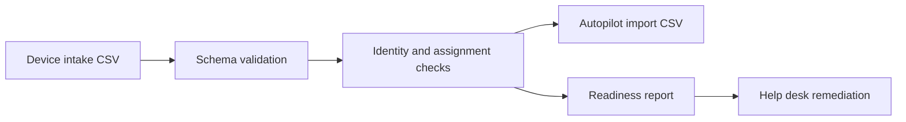

# Offline Autopilot Intake and Import-File Validator

[](https://github.com/vxti-glitch/intune-autopilot-lab-kit/actions/workflows/python-tests.yml)


An offline Autopilot intake and import-file validator for a portfolio lab.

This project is intentionally offline-safe. It does not connect to a tenant, upload device hashes, or require Microsoft Graph permissions. Instead, it mirrors the intake, validation, import-file preparation, and documentation workflow a Tier 1 or Tier 2 technician would use before handing devices to an endpoint admin.

## Interactive demo

[Launch the Autopilot Readiness Lab](https://vxti-glitch.github.io/intune-autopilot-lab-kit/)

The browser demo lets a recruiter or hiring manager complete the workflow without installing Python or accessing a Microsoft tenant:

- Switch between synthetic device-intake scenarios
- Run the same identity, strict import, optional expected-mapping, and age checks as the Python tool
- Inspect device-level remediation and endpoint-admin handoff notes
- Use an Intune-inspired command bar, device search, expected-assignment status, and simulated sync state without claiming tenant verification
- Preview and download the generated import CSV, Markdown report, or JSON report
- Optionally load a CSV that stays inside the browser and is never uploaded

> **Portfolio disclosure:** I ran the parser, validation rules, report generation, automated tests, and browser simulation locally. This is a simulated portfolio project, not paid employment, tenant administration, device enrollment, or production deployment experience. All included people, devices, hashes, and tenant data are fictional.


_Sample run using the included synthetic Contoso device data._

## What it demonstrates

- Autopilot device intake validation
- Import CSV generation using the columns expected by Windows Autopilot
- Duplicate serial and hardware hash detection
- Assigned user and group tag hygiene checks
- Device age and readiness reporting
- Help desk runbook writing
- Automated Python unit tests and GitHub Actions CI
- Recruiter-friendly interactive workflow published with GitHub Pages
- Current, source-dated classic Autopilot versus device-preparation field guide
- Twelve simulated troubleshooting scenarios with local-versus-tenant evidence boundaries

## Workflow



## Quick start

```powershell
python .\src\autopilot_lab.py --devices .\samples\devices.csv --out .\reports --tenant-name "Contoso Lab"
```

Use `--fail-on-high` when running this in automation and you want duplicate device identity issues to fail the job.

Generated files:

- `reports/autopilot-import.csv`
- `reports/readiness-report.json`
- `reports/readiness-report.md`

See the checked-in [example readiness report](docs/examples/readiness-report.md), [example JSON](docs/examples/readiness-report.json), and [example import CSV](docs/examples/autopilot-import.csv).

To preview the interactive demo locally:

```powershell
python -m http.server 8000 --directory docs
```

Then open `http://127.0.0.1:8000`. The GitHub Pages workflow publishes the `docs` directory after Pages is configured to use GitHub Actions.

## Input CSV

Required columns:

- `SerialNumber`
- `HardwareHash`

Optional planning columns:

- `GroupTag`
- `AssignedUser`
- `Manufacturer`
- `Model`
- `PurchaseDate`

Example:

```csv
SerialNumber,HardwareHash,Manufacturer,Model,GroupTag,AssignedUser,PurchaseDate
LAB-001,BASE64HASHVALUE001,Dell,Latitude 5440,HELPDESK-STD,alex.johnson@contoso.com,2025-05-10
```

Do not commit real hardware hashes or tenant data to a public repository. Use the sample data for demos.

The richer intake CSV above is not the strict Microsoft import file. The generated strict export uses the exact case-sensitive headers `Device Serial Number`, `Windows Product ID`, `Hardware Hash`, `Group Tag`, and `Assigned User`; serial number and hardware hash are required, the other fields are optional, extra columns and quotation marks are not allowed, manual batches are limited to 500 device rows, and Microsoft specifies ANSI-format text. These rules were checked on **2026-08-31** against [Microsoft Learn: Manually register devices with Windows Autopilot](https://learn.microsoft.com/en-us/autopilot/add-devices). The generator writes Windows-1252 (`cp1252`) as an ANSI-compatible encoding and rejects values that would require CSV quoting.

Group tags can inform an expected `OrderID`-based dynamic-group mapping, but this offline lab cannot verify Entra group membership or Intune profile, app, or policy assignments.

## Not demonstrated

- Tenant registration
- Dynamic-group evaluation
- Profile assignment
- Device enrollment
- Enrollment Status Page behavior
- Compliance evaluation
- Application delivery
- Production device deployment

See [How I built and verified this](docs/HOW_I_BUILT_AND_VERIFIED_THIS.md) for the exact local evidence and remaining boundary.

## Discussion topics

- How Intune enrollment differs from traditional imaging
- Why device identity and user assignment accuracy matters
- How bad intake data causes deployment delays
- How `-WhatIf` style dry runs and reports reduce risky production changes
- How to document escalation-ready findings for endpoint admins
